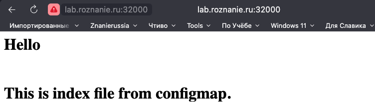
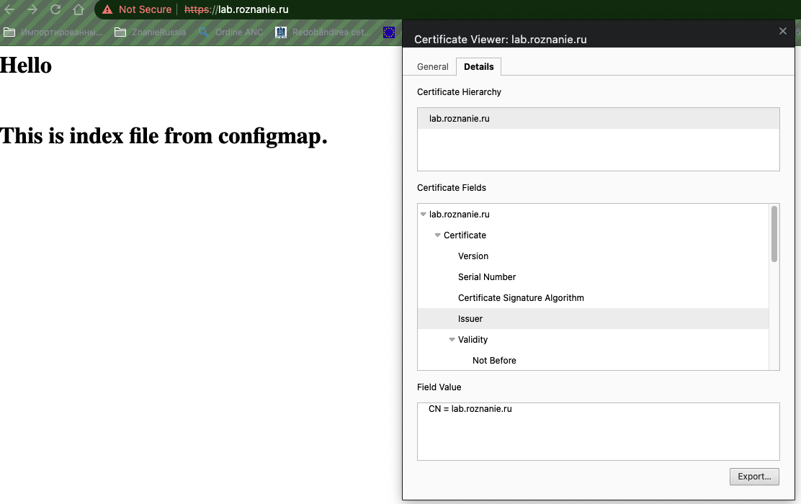

# Домашнее задание к занятию "Конфигурация приложений"

### Цель задания

В тестовой среде Kubernetes необходимо создать конфигурацию и продемонстрировать работу приложения.

------

### Чеклист готовности к домашнему заданию

1. Установленное k8s-решение (например, MicroK8S).
2. Установленный локальный kubectl.
3. Редактор YAML-файлов с подключенным github-репозиторием.

------

### Инструменты/ дополнительные материалы, которые пригодятся для выполнения задания

1. [Описание](https://kubernetes.io/docs/concepts/configuration/secret/) Secret
2. [Описание](https://kubernetes.io/docs/concepts/configuration/configmap/) ConfigMap
3. [Описание](https://github.com/wbitt/Network-MultiTool) Multitool

------

### Задание 1. Создать Deployment приложения и решить возникшую проблему с помощью ConfigMap. Добавить web-страницу

1. Создать Deployment приложения, состоящего из контейнеров busybox и multitool.
2. Решить возникшую проблему с помощью ConfigMap
3. Продемонстрировать, что pod стартовал, и оба конейнера работают.
4. Сделать простую web-страницу и подключить ее к Nginx с помощью ConfigMap. Подключить Service и показать вывод curl или в браузере.
5. Предоставить манифесты, а также скриншоты и/или вывод необходимых команд.

## Ответ

- [deployment-confmap.yaml](./src/deployment-confmap.yaml)
- [service.yaml](./src/service.yaml)
- [index-configmap.yaml](./src/index-configmap.yaml)
```
❯ kubectl apply -f service.yaml
service/myservice created
❯ kubectl apply -f index-configmap.yaml
configmap/index-html-configmap created
❯ kubectl apply -f deployment-confmap.yaml
deployment.apps/myapp-pod created
❯ kubectl get pod
NAME                         READY   STATUS    RESTARTS   AGE
myapp-pod-5bb5fbc745-rrtnf   1/1     Running   0          94s
❯ kubectl describe po myapp-pod-5bb5fbc745-rrtnf
Name:             myapp-pod-5bb5fbc745-rrtnf
Namespace:        default
Priority:         0
Service Account:  default
Node:             microk8s/10.129.0.30
Start Time:       Tue, 09 May 2023 15:22:14 +0300
Labels:           app=myapp
                  pod-template-hash=5bb5fbc745
Annotations:      cni.projectcalico.org/containerID: c9ad08c1405348b5bbd2429d9bea8a9e1b27bc9a86ff1974de15a66a2ddb38df
                  cni.projectcalico.org/podIP: 10.1.128.209/32
                  cni.projectcalico.org/podIPs: 10.1.128.209/32
Status:           Running
IP:               10.1.128.209
IPs:
  IP:           10.1.128.209
Controlled By:  ReplicaSet/myapp-pod-5bb5fbc745
Init Containers:
  init-myservice:
    Container ID:  containerd://022f289cd33af5175ca53c80abb309fe69e063d5ad9419ab02a021cf36d04c37
    Image:         busybox:1.28
    Image ID:      docker.io/library/busybox@sha256:141c253bc4c3fd0a201d32dc1f493bcf3fff003b6df416dea4f41046e0f37d47
    Port:          <none>
    Host Port:     <none>
    Command:
      sh
      -c
      until nslookup myservice.$(cat /var/run/secrets/kubernetes.io/serviceaccount/namespace).svc.cluster.local; do echo waiting for myservice; sleep 2; done
    State:          Terminated
      Reason:       Completed
      Exit Code:    0
      Started:      Tue, 09 May 2023 15:22:14 +0300
      Finished:     Tue, 09 May 2023 15:22:14 +0300
    Ready:          True
    Restart Count:  0
    Environment:    <none>
    Mounts:
      /var/run/secrets/kubernetes.io/serviceaccount from kube-api-access-vjs6n (ro)
Containers:
  network-multitool:
    Container ID:   containerd://b0b4afac8a84323a301f27c202c1ed6e73735afe4ed61655c2194eaa7a5af540
    Image:          wbitt/network-multitool
    Image ID:       docker.io/wbitt/network-multitool@sha256:82a5ea955024390d6b438ce22ccc75c98b481bf00e57c13e9a9cc1458eb92652
    Port:           <none>
    Host Port:      <none>
    State:          Running
      Started:      Tue, 09 May 2023 15:22:15 +0300
    Ready:          True
    Restart Count:  0
    Limits:
      cpu:     200m
      memory:  512Mi
    Requests:
      cpu:        100m
      memory:     256Mi
    Environment:  <none>
    Mounts:
      /usr/share/nginx/html/ from nginx-index-file (rw)
      /var/run/secrets/kubernetes.io/serviceaccount from kube-api-access-vjs6n (ro)
Conditions:
  Type              Status
  Initialized       True 
  Ready             True 
  ContainersReady   True 
  PodScheduled      True 
Volumes:
  nginx-index-file:
    Type:      ConfigMap (a volume populated by a ConfigMap)
    Name:      index-html-configmap
    Optional:  false
  kube-api-access-vjs6n:
    Type:                    Projected (a volume that contains injected data from multiple sources)
    TokenExpirationSeconds:  3607
    ConfigMapName:           kube-root-ca.crt
    ConfigMapOptional:       <nil>
    DownwardAPI:             true
QoS Class:                   Burstable
Node-Selectors:              <none>
Tolerations:                 node.kubernetes.io/not-ready:NoExecute op=Exists for 300s
                             node.kubernetes.io/unreachable:NoExecute op=Exists for 300s
Events:
  Type    Reason     Age   From               Message
  ----    ------     ----  ----               -------
  Normal  Scheduled  108s  default-scheduler  Successfully assigned default/myapp-pod-5bb5fbc745-rrtnf to microk8s
  Normal  Pulled     108s  kubelet            Container image "busybox:1.28" already present on machine
  Normal  Created    108s  kubelet            Created container init-myservice
  Normal  Started    108s  kubelet            Started container init-myservice
  Normal  Pulled     107s  kubelet            Container image "wbitt/network-multitool" already present on machine
  Normal  Created    107s  kubelet            Created container network-multitool
  Normal  Started    107s  kubelet            Started container network-multitool
```
Проверка curl
```
❯ curl lab.roznanie.ru:32000
<html>
<h1>Hello</h1>
</br>
<h1>This is index file from configmap. </h1>
</html
``` 
В Браузере
<br>

------

### Задание 2. Создать приложение с вашей web-страницей, доступной по HTTPS 

1. Создать Deployment приложения состоящего из nginx.
2. Создать собственную web-страницу и подключить ее как ConfigMap к приложению.
3. Выпустить самоподписной сертификат SSL. Создать Secret для использования данного сертификата.
4. Создать Ingress и необходимый Service, подключить к нему SSL в вид. Продемонстировать доступ к приложению по HTTPS. 
4. Предоставить манифесты, а также скриншоты и/или вывод необходимых команд.

## Ответ

- [deployment2-confmap.yaml](./src/deployment2-confmap.yaml)
- [ingress.yaml](./src/ingress.yaml)
- [index-configmap.yaml](./src/index-configmap.yaml)

Выпустил самоподписной SSL сертификат
```
iworks@microk8s:~$ openssl req -x509 -newkey rsa:4096 -sha256 -nodes -keyout tls.key -out tls.crt -subj "/CN=lab.roznanie.ru" -days 365
........+.......+.........+.....+.+..+..........+..+......+.......+..+....+..+...............+....+......+..+...+...+++++++++++++++++++++++++++++++++++++++++++++++++++++++++++++++++*.+...+.............+..+....+...+...........+.+.....+.+...+......+...........+.......+..+.........+.......+...+.................+.......+++++++++++++++++++++++++++++++++++++++++++++++++++++++++++++++++*.+..+.+..+...+...........................+...+....+..+.............+.....+.........................+...+...+.................+....+......+.....+.........+....+..+.......+............+...
```

Скопировал файлы сертификата с сервера в папку проекта
```
❯ scp iworks@158.160.18.22://home/iworks/tls.crt ../ssl
tls.crt                                                                                                      100% 1822    52.7KB/s   00:00    
❯ scp iworks@158.160.18.22://home/iworks/tls.key ../ssl
tls.key         
```

Создаю secret с файлами сертификата
```
❯ kubectl create secret tls my-app-secret-tls --cert=../ssl/tls.crt --key=../ssl/tls.key
secret/my-app-secret-tls created
```
проверяем
```
❯ kubectl get secret -o yaml
apiVersion: v1
items:
- apiVersion: v1
  data:
    tls.crt: LS0tLS1CRUdJTiBDRVJUSUZJQ0FURS0tLS0tCk1JSUZGVENDQXYyZ0F3SUJBZ0lVQ21IZUF2S01KNUJ0WFVEVWxIcmdKQ3JSUENFd0RRWUpLb1pJaHZjTkFRRUwKQlFBd0dqRVlNQllHQTFVRUF3d1BiR0ZpTG5KdmVtNWhibWxsTG5KMU1CNFhEVEl6TURVd09URTROVEV6TjFvWApEVEkwTURVd09ERTROVEV6TjFvd0dqRVlNQllHQTFVRUF3d1BiR0ZpTG5KdmVtNWhibWxsTG5KMU1JSUNJakFOCkJna3Foa2lHOXcwQkFRRUZBQU9DQWc4QU1JSUNDZ0tDQWdFQXd4MzJrMUZjOVlnOVJFc1VmTFBreUZwWlpwY0oKM05QWmhva2NiTHVyelgxOHQvNXFlcVNRR2V6UXNaZERiOU1Wei9sOUlDVFd5MzhpaDUyRVV2bWZwaXlsT3lxUApvRmZZbjU3NThTV2xhT3pHeGNzMDVmTDZzTkRTbWQ3RkpaYlFDMUVxbDJVTG52ZXovQTRWQjhJYUVZd242bzBPClRLa3A3UTVEWlFGL2tvSGptK215ekQxUjVBWDdLcVJwYTlDWnhUcllNbkRFTXd1Sml4cU5iZjloOU1lcElOMUcKMksvYVVuQjF0V3VPNWVhRzNEcG45ZUxBejFzRzRrd0J3UDZuTXlYVysvR0ZrWWJGSU5qd0k0UmZCSHJ5ZUpNaApEUWFESktuSnlHWjNlZGE2dzhGT0tYVG5CcThFUmJoTy95UXE3SUVoZkwzVjFFOE0xZnhVeGJiZFZPTmJ6NXNGCmZlWkNlYWVmR0dIbGtCMkZSR3FBNER4RVZUdHRIR3lkZDlodjNQY0RSUjA0LzlzcXNaUVcyVU9sdFFneUUyNSsKSWVtUFgvbm1DbGxMVWVQQ0RQeG95WVQ1TkRYVER0RVp2NWloWnJIeU85Z3JXTldVQmw0OHhkMUNNMy9YcUwveQpFbFVDSU11VW9QMmNvbHZSaTdkaUY1YjBJR21UWXAxY21JOTE2N2hUT256bTRmcUJrRlNlaUZCNUNhYXdoUWtTCk1hcGNiZk5vSmE5N2s3ZnVjTWxHWWYvRUs1bkh0S3h3R2I5NFlOWXVRaGhGc2dqZ1F1eVlNMGV3Q1QyVTFIa20KbmRGOHBGTU1CYXp2dmp3eFFPQnE0UHhFUG5mWUs5ZU5BTWhZZUxKd29WeXUyLytYTUxzK1BXeEwrUWZuTVdvNgovQlN5Qk94UnFSNVBrdzhDQXdFQUFhTlRNRkV3SFFZRFZSME9CQllFRkZibHRPZ25iVDlHOCtweWs0UG1peUdrCjNxb2ZNQjhHQTFVZEl3UVlNQmFBRkZibHRPZ25iVDlHOCtweWs0UG1peUdrM3FvZk1BOEdBMVVkRXdFQi93UUYKTUFNQkFmOHdEUVlKS29aSWh2Y05BUUVMQlFBRGdnSUJBQXNqM1p3L3hSRWhGcENuYzhYWnpSRUc1N29uaFFmQQpEc1lBUDhpbFRGRnY5bkRobmh5WnJXLzc5ejNvRDdQNWpLRmpOTU5sa3pNL0x2NkY2TWhkT3ovM3FES2Zib2NECmRNUm5PdTNReGRnTEptYU1UYXhrdmJoaGhZeEZkM2NaVmpJaFNwdjQ3TS8rMm9YbklYRzNJRGNDM0NTWmFtaHIKbnRaTzVUOE5vV3JZUGQ1Y1ZnTDV3UkVYY2R3bFhqYlZGYlVTTHdENmZDR0g4RlJkT0RBMmFHT0ZROFpYQ1RJbwpNaVArQXQ5enVPcjJ4N2crb0x1UGtWejNtODI3R1FrWWVjVEdsQ29VbllHMVk3d2N3ZFAwYnpKcWV0dldOOEJ6CjVDRWlpUmZoK2NBRSs3bXJVbktJOHE2bHZ2Ym1mMFJOWDlUUGlISlBWVFBRNDV2MkVrKzAwR3VBSTllMXd5ZkoKbzdHa1c0QlQ4OGFVeFFVbElQb1pqYXRaU1dhMzFJeGliQ2FPaTVrMWhLMkNocm5WT3ByL3g1a2ZTd3BINTVmVApXOFpxb25JbFA2eDhUQkVWOFhUTUtreVRHVFBJdW55VEp1REFtSldjVWZwWHRIT3NoNlZkOEhRa1NvcEdxTHFXCklUQnp2U3pPR0E0REh6QjdXVWw2cGN0dTRJUG0xUncrR09zb0tVOUk5aVBqOGhwR2tEQ3Y3NnR2Z015bHZNd1YKMllJU2tlcmhSMC9iN29BVDNES0duQ3FzT25WUjZZS25MVlVXSkdYL0drc2NlUFk5SEFKKzhObzJWejNrVWVMRgpLMW5kQlBlWkI0Y3ZjSWMra1dPb3MyUERZMmRXQ0QxTVFYTFNYY3owNjR2WDY4L2hWRzJ1TmNOWk1LRlBJc0NzCnZwS2J5cW1OaWRzMwotLS0tLUVORCBDRVJUSUZJQ0FURS0tLS0tCg==
    tls.key: LS0tLS1CRUdJTiBQUklWQVRFIEtFWS0tLS0tCk1JSUpSQUlCQURBTkJna3Foa2lHOXcwQkFRRUZBQVNDQ1M0d2dna3FBZ0VBQW9JQ0FRRERIZmFUVVZ6MWlEMUUKU3hSOHMrVElXbGxtbHduYzA5bUdpUnhzdTZ2TmZYeTMvbXA2cEpBWjdOQ3hsME52MHhYUCtYMGdKTmJMZnlLSApuWVJTK1orbUxLVTdLbytnVjlpZm52bnhKYVZvN01iRnl6VGw4dnF3ME5LWjNzVWxsdEFMVVNxWFpRdWU5N1A4CkRoVUh3aG9SakNmcWpRNU1xU250RGtObEFYK1NnZU9iNmJMTVBWSGtCZnNxcEdscjBKbkZPdGd5Y01RekM0bUwKR28xdC8ySDB4NmtnM1ViWXI5cFNjSFcxYTQ3bDVvYmNPbWYxNHNEUFd3YmlUQUhBL3FjekpkYjc4WVdSaHNVZwoyUEFqaEY4RWV2SjRreUVOQm9Na3FjbklabmQ1MXJyRHdVNHBkT2NHcndSRnVFNy9KQ3JzZ1NGOHZkWFVUd3pWCi9GVEZ0dDFVNDF2UG13Vjk1a0o1cDU4WVllV1FIWVZFYW9EZ1BFUlZPMjBjYkoxMzJHL2M5d05GSFRqLzJ5cXgKbEJiWlE2VzFDRElUYm40aDZZOWYrZVlLV1V0UjQ4SU0vR2pKaFBrME5kTU8wUm0vbUtGbXNmSTcyQ3RZMVpRRwpYanpGM1VJemY5ZW92L0lTVlFJZ3k1U2cvWnlpVzlHTHQySVhsdlFnYVpOaW5WeVlqM1hydUZNNmZPYmgrb0dRClZKNklVSGtKcHJDRkNSSXhxbHh0ODJnbHIzdVR0KzV3eVVaaC84UXJtY2UwckhBWnYzaGcxaTVDR0VXeUNPQkMKN0pnelI3QUpQWlRVZVNhZDBYeWtVd3dGck8rK1BERkE0R3JnL0VRK2Q5Z3IxNDBBeUZoNHNuQ2hYSzdiLzVjdwp1ejQ5YkV2NUIrY3hhanI4RkxJRTdGR3BIaytURHdJREFRQUJBb0lDQUFTSXhya25zK1JVMVMrb0d3TEczM00wCmZrMWZCekNsajdHTHNDaHF1QlJmYlMyTmNRWUdtdjZ2UFM1VFdKTFpzZkVTV0RFT0NodlNpWWZqUmpiemJCMWQKZmoyQXdMTzJOdWVHdDBJK1lMaXVmL1FLdytEd0k1bEdVUTZZV2JhRTZiTEpvUmJCbDJLTFdSaHJiMXV0ekJOSwpVWWNtM2dVMERUQmdHM3JXYlJPSGh6V1JXY0ZiVDNMZ0hMVWgrdjB4Yk5Gamk3Q29aRGJYZHN2UHd5ZWlQckdFCmprNmdOY3hGVWVxR2lJVzl5U1ZZbFJ1N0U3MW9GcGo3QVk3eXV6dXo3MGpHQVZmN2hlSWE0cXZmdnJ6a2o1eTQKQ3JoNG10VUZxTGlLWlpFTnFJc2hUVmZOUHpiQmE3a0JDalZna2gxbHhzV1dQcVA2ZVdTa3JhU3ZaM3pzd2ZuegpwMmxHV1Fad1hoUlZmSWJWRExlUWNqUEZJRFF0dkFCa21JemMrU0hLRkk5cDN3NzN6aHBiNUFWeG1yOHRzZ0FNCm1ndEdoUzNOV3l3SytqbGFVeTBPQ2t2aGlxUmNjWlhXRHlyd25UZ0ZyS0JDYUNwWkphYmJkb1BvUXpOMzcvcUwKZnh3TFZCWFlKV2FjVEloRWt5OUEzRThPR1lrQkdXTW9WT0hCeEpFNklRL0NsK3laU2RTejZpWm0vOFl0RHZ2YQo3N2VvVkhTVGd1L3pnNnZpV0ttRGFQcUhtRUZ5NSsvei9vNUxDdXR2RkZEd21rMHRFSjZUbXlCa3VvaTA5bis0Cno4Ym9WcDRlMkZyRlNsTllEL21qVTZJNjV4QXBrSXJJT2pJL3dGSlM0NXNuWmIwL2J6c2hSMDY2Um5RMVBvLzEKMnJtNXAwTmxGdGRybXBOdXdKQzVBb0lCQVFEZjJabWVodzVweHkyN0FMY2lRVzl0K3FaWVFvSHJCOTVZWHl6TQo1MEZKb0xkVU1mbTlTY3lGVXVuTEFiaTQxSVZ5MkpMVWl5bjBoT0JWdE9Lc0FZUTdUckhybzdYcTlNaG1SZmlzCm44S3M5K0lFZDZDRG9DM28rblNBZUtIVHdONHlpWlRva2w0cU5TbWtKUjRTOU93UXJLdUc4Q2RVZmpzOTl5c1MKSnVpemtQL3FuSHQvYWphWmI4WGZFT1JHWmZqZHlGdGk5WmdHbmNhUFdRSkFVdGk3MStvSGg1T0N3MXd6cHdsSAp5c0k0TmhIR1hFbHdFMXlnem9la3F2NXN4cU9raUp5ZWFiRmc1UUUyc0VJY3NRVnkxbUlUc1o3WUt0V21rS0JpCnJkTkpERFJ4WXp0L213OWZVL1A1WjI5V2VVanI0T3RBYVA4cE05VFNtZlVBN1VTVkFvSUJBUURmSSt5OWFQUzMKRHNMV0hqNEZZOUI2elBuMkFrOHpIaS9hVXNhRnFLTkdvOTEwQW1kTTdhai90NTUvbUhEN2t6UXdUL0VnV0JxcApaN2laT0tuYWxXRTBQZXFrR0tJZ2YycGJrYUFES3d3UkNZSW1tWk9MclVvQVh5NDZCMnYwd1V0T0NSSHJMOFR2CjdaMmM1KytuQWRZNUVHSU51QzZ1cE9yRHVYTWJOUzc4U1hVRnZacjd1OTljamtxdnJybVZPYjJZRUpLSFZSZ00KWU1oQ3JEd2o3bTFRdU9rcEtBWHVPdjRqcFpSdXNnbGQ4M2pDOW52ZmlFbWFOYlBvek53d1JEZlRTblZiRWVaUAprU1Z3amhXR25EcldRSTRHMVZGLzdQbS96VU9GNjhXVktVdjhVbC9JZlc2L0hoYXJ5Zkx5a0JjVUFrK0RQdWJYClNGQk1leTl2Nm93VEFvSUJBUUN5c3VXZDFqYzlYbEkxZlFhMWhBTk9pdEFNbVZ0Wm96aHUxOXZOMzdjUTdnb3MKWHBEOStWSWFCT3k2c1M4ajdoUnljRTRXK3RtTmFCNG1qWForMWQ4WDhXUzd0ajlkeC9mTEhZUzlXZlJ4WEpuRAo4elBpb0JiR2JGcGd6T3h6UFA2azNZeFFkYmhTZllvMmphTUtneGVJNEM4MlU3VXlFR3QrdGpoZUQwMnBPOUh4Ckd1YkQrcWlIcU9FUGlFNlRuSWdsbFBMUGR6dmIzRXhNMTBPaTBnQlBSTGlCTmt3ZUVaTWpjTzlKcnFXSmRqQ08KWjlJQWRKUjNreWhaM2wrcHVwR2NvYXBXRkE0VVNmekVDY1ZkWGp2NVJ3ZVlyUzBmYUdLU3k5WWRzS0tCS0FzZAprWmhIOENNL2VLZkZyRHNIajE4VlhzS3U4cUx2NDM2OGVVZExiQjVaQW9JQkFRRFlZM3czQ2tzV0ltaHJRQlNoCklYU1JRYW05R2V3NEJEUWZvbG9HVDgxV3VaNE4zQzdVK1R3RUQ4clNyY0FURjJOcTNudFZCRnVHb0tEeFpYUEMKRjA2V1hOem9tVUxRQlAvZElORnRnUmRJaGxJQ29MZm1vZnU3ZEpIZGtFanVwMndobHNZYnJzMXFacUdNQVpmegordUlGb0krV0FtQ3kyQmNhQ3dOSEJVSTFRZjhMdkIxSnRaMGJvcGxtMlNmN1FHMU53L1IwN041UFVxT2hsR2tWCjV5ZDNPbnBSZ1JDUFFBSW9DM0J3RUpMbzJ5em0xQ1M0VnZBWmJhNjBPY1hsd0tIcWNyQnZ5bUh3RXkrZGdRdjYKNkJKZXAyZVQxTlllR203dncxeVJ5RnhwRkEwdCthd05QeVpnakFzc09NRXkzT3lrYU1FMjQ0NzBncG5zTVNHRgpoSXlsQW9JQkFRQ3FiR0FXY0NFVGY0SDF0aWNlTGJVNGVyb1pNWXA2cEdyVVhzdDlRKzFPUEJsMlZ4WGxWOGcrClRHOTJzcVlLQXQ0R1hObHM2U05wL3lQSng1RzZwNU1nWm4yaUNMMmxPTmRwMUh6R2NkcnVTbHI3NWtJaTg3R1cKSGtuVVNFQlhuTHdPMkExazM0NlUvWWpiWDRrYVRNN1lubDUzWG9PeGJCbUxMRnVsVlFNM1ZOUUlQTVpTZU1sVgpxaHQvTFBHL09hMk9jRDNDRnBnVGQxeFNHdG1xVDNZRTlpcStHSkVlT09GcFlES0R5MnAwRnBRR09Uc2VCQ0ZBCmdRNkF2Z1FES3FxYUxTZ1ZvY0JsbGlIbUt4UkYrQWdqYVdyRnd6SVpWMzFLMk51RWhwVDFlTHhjWU9tVUFZcjMKOTVrV2VIM3h1M2QrVzZzVEZqdWZ2akxNMU5RcEFuL3gKLS0tLS1FTkQgUFJJVkFURSBLRVktLS0tLQo=
  kind: Secret
  metadata:
    creationTimestamp: "2023-05-09T18:57:19Z"
    name: my-app-secret-tls
    namespace: default
    resourceVersion: "981083"
    uid: 697dc361-9d6b-4e81-a4e9-cdf496364d05
  type: kubernetes.io/tls
kind: List
metadata:
  resourceVersion: ""
```



------

### Правила приема работы

1. Домашняя работа оформляется в своем Git репозитории в файле README.md. Выполненное домашнее задание пришлите ссылкой на .md-файл в вашем репозитории.
2. Файл README.md должен содержать скриншоты вывода необходимых команд `kubectl`, а также скриншоты результатов
3. Репозиторий должен содержать тексты манифестов или ссылки на них в файле README.md

------
