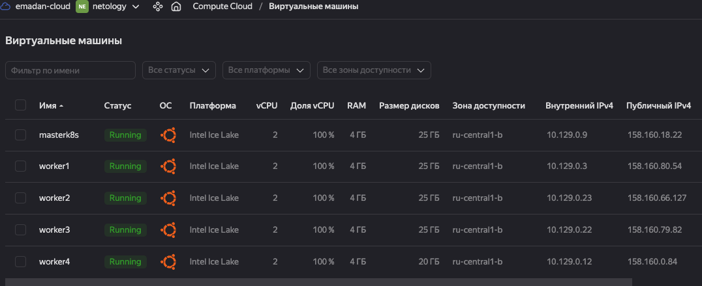

# Домашнее задание к занятию "Установка кластера K8s"

### Цель задания

Установить кластер K8s.

### Чеклист готовности к домашнему заданию

1. Развернутые ВМ с ОС Ubuntu 20.04-lts


### Инструменты и дополнительные материалы, которые пригодятся для выполнения задания

1. [Инструкция по установке kubeadm](https://kubernetes.io/docs/setup/production-environment/tools/kubeadm/create-cluster-kubeadm/)
2. [Документация kubespray](https://kubespray.io/)

-----

### Задание 1. Установить кластер k8s с 1 master node

1. Подготовка работы кластера из 5 нод: 1 мастер и 4 рабочие ноды.
2. В качестве CRI — containerd.
3. Запуск etcd производить на мастере.
4. Способ установки выбрать самостоятельно.

## Ответ
Развернуты 5 виртуалок через UI <br>

<br>
Предварительно установил на masterk8s git, python и pip3 <br>
Клонируем репу kubespray
```
iworks@masterk8s:~$ git clone https://github.com/kubernetes-sigs/kubespray
Cloning into 'kubespray'...
remote: Enumerating objects: 70127, done.
remote: Counting objects: 100% (771/771), done.
remote: Compressing objects: 100% (509/509), done.
remote: Total 70127 (delta 187), reused 648 (delta 182), pack-reused 69356
Receiving objects: 100% (70127/70127), 22.29 MiB | 21.31 MiB/s, done.
Resolving deltas: 100% (39235/39235), done.
iworks@masterk8s:~$ cd kubespray/
iworks@masterk8s:~/kubespray$ 
```

Устанавливаем зависимости
```
iworks@masterk8s:~/kubespray$ pip3 install -r requirements.txt
Defaulting to user installation because normal site-packages is not writeable
Collecting ansible==7.6.0
  Downloading ansible-7.6.0-py3-none-any.whl (43.8 MB)
     ━━━━━━━━━━━━━━━━━━━━━━━━━━━━━━━━━━━━━━━━ 43.8/43.8 MB 4.8 MB/s eta 0:00:00
Collecting ansible-core==2.14.6
  Downloading ansible_core-2.14.6-py3-none-any.whl (2.2 MB)
     ━━━━━━━━━━━━━━━━━━━━━━━━━━━━━━━━━━━━━━━━ 2.2/2.2 MB 102.4 MB/s eta 0:00:00
Collecting cryptography==41.0.1
  Downloading cryptography-41.0.1-cp37-abi3-manylinux_2_28_x86_64.whl (4.3 MB)
     ━━━━━━━━━━━━━━━━━━━━━━━━━━━━━━━━━━━━━━━━ 4.3/4.3 MB 64.8 MB/s eta 0:00:00
Collecting jinja2==3.1.2
  Downloading Jinja2-3.1.2-py3-none-any.whl (133 kB)
     ━━━━━━━━━━━━━━━━━━━━━━━━━━━━━━━━━━━━━━━━ 133.1/133.1 KB 8.5 MB/s eta 0:00:00
Collecting jmespath==1.0.1
  Downloading jmespath-1.0.1-py3-none-any.whl (20 kB)
Collecting MarkupSafe==2.1.3
  Downloading MarkupSafe-2.1.3-cp310-cp310-manylinux_2_17_x86_64.manylinux2014_x86_64.whl (25 kB)
Collecting netaddr==0.8.0
  Downloading netaddr-0.8.0-py2.py3-none-any.whl (1.9 MB)
     ━━━━━━━━━━━━━━━━━━━━━━━━━━━━━━━━━━━━━━━━ 1.9/1.9 MB 87.9 MB/s eta 0:00:00
Collecting pbr==5.11.1
  Downloading pbr-5.11.1-py2.py3-none-any.whl (112 kB)
     ━━━━━━━━━━━━━━━━━━━━━━━━━━━━━━━━━━━━━━━━ 112.7/112.7 KB 22.9 MB/s eta 0:00:00
Collecting ruamel.yaml==0.17.31
  Downloading ruamel.yaml-0.17.31-py3-none-any.whl (112 kB)
     ━━━━━━━━━━━━━━━━━━━━━━━━━━━━━━━━━━━━━━━━ 112.1/112.1 KB 15.2 MB/s eta 0:00:00
Collecting ruamel.yaml.clib==0.2.7
  Downloading ruamel.yaml.clib-0.2.7-cp310-cp310-manylinux_2_17_x86_64.manylinux2014_x86_64.manylinux_2_24_x86_64.whl (485 kB)
     ━━━━━━━━━━━━━━━━━━━━━━━━━━━━━━━━━━━━━━━━ 485.6/485.6 KB 34.3 MB/s eta 0:00:00
Requirement already satisfied: PyYAML>=5.1 in /usr/lib/python3/dist-packages (from ansible-core==2.14.6->-r requirements.txt (line 2)) (5.4.1)
Collecting resolvelib<0.9.0,>=0.5.3
  Downloading resolvelib-0.8.1-py2.py3-none-any.whl (16 kB)
Collecting packaging
  Downloading packaging-23.1-py3-none-any.whl (48 kB)
     ━━━━━━━━━━━━━━━━━━━━━━━━━━━━━━━━━━━━━━━━ 48.9/48.9 KB 6.1 MB/s eta 0:00:00
Collecting cffi>=1.12
  Downloading cffi-1.15.1-cp310-cp310-manylinux_2_17_x86_64.manylinux2014_x86_64.whl (441 kB)
     ━━━━━━━━━━━━━━━━━━━━━━━━━━━━━━━━━━━━━━━━ 441.8/441.8 KB 37.3 MB/s eta 0:00:00
Collecting pycparser
  Downloading pycparser-2.21-py2.py3-none-any.whl (118 kB)
     ━━━━━━━━━━━━━━━━━━━━━━━━━━━━━━━━━━━━━━━━ 118.7/118.7 KB 13.2 MB/s eta 0:00:00
Installing collected packages: resolvelib, netaddr, ruamel.yaml.clib, pycparser, pbr, packaging, MarkupSafe, jmespath, ruamel.yaml, jinja2, cffi, cryptography, ansible-core, ansible
  WARNING: The script netaddr is installed in '/home/iworks/.local/bin' which is not on PATH.
  Consider adding this directory to PATH or, if you prefer to suppress this warning, use --no-warn-script-location.
  WARNING: The script pbr is installed in '/home/iworks/.local/bin' which is not on PATH.
  Consider adding this directory to PATH or, if you prefer to suppress this warning, use --no-warn-script-location.
  WARNING: The scripts ansible, ansible-config, ansible-connection, ansible-console, ansible-doc, ansible-galaxy, ansible-inventory, ansible-playbook, ansible-pull and ansible-vault are installed in '/home/iworks/.local/bin' which is not on PATH.
  Consider adding this directory to PATH or, if you prefer to suppress this warning, use --no-warn-script-location.
  WARNING: The script ansible-community is installed in '/home/iworks/.local/bin' which is not on PATH.
  Consider adding this directory to PATH or, if you prefer to suppress this warning, use --no-warn-script-location.
Successfully installed MarkupSafe-2.1.3 ansible-7.6.0 ansible-core-2.14.6 cffi-1.15.1 cryptography-41.0.1 jinja2-3.1.2 jmespath-1.0.1 netaddr-0.8.0 packaging-23.1 pbr-5.11.1 pycparser-2.21 resolvelib-0.8.1 ruamel.yaml-0.17.31 ruamel.yaml.clib-0.2.7
```

```
iworks@masterk8s:~/kubespray$ declare -a IPS=(10.129.0.9 10.129.0.3 10.129.0.23 10.129.0.22 10.128.0.23)
iworks@masterk8s:~/kubespray$ CONFIG_FILE=inventory/mycluster/hosts.yaml python3 contrib/inventory_builder/inventory.py ${IPS[@]}
DEBUG: Adding group all
DEBUG: Adding group kube_control_plane
DEBUG: Adding group kube_node
DEBUG: Adding group etcd
DEBUG: Adding group k8s_cluster
DEBUG: Adding group calico_rr
DEBUG: adding host node1 to group all
DEBUG: adding host node2 to group all
DEBUG: adding host node3 to group all
DEBUG: adding host node4 to group all
DEBUG: adding host node5 to group all
DEBUG: adding host node1 to group etcd
DEBUG: adding host node2 to group etcd
DEBUG: adding host node3 to group etcd
DEBUG: adding host node1 to group kube_control_plane
DEBUG: adding host node2 to group kube_control_plane
DEBUG: adding host node1 to group kube_node
DEBUG: adding host node2 to group kube_node
DEBUG: adding host node3 to group kube_node
DEBUG: adding host node4 to group kube_node
DEBUG: adding host node5 to group kube_node
iworks@masterk8s:~/kubespray$ cat inventory/mycluster/hosts.yaml
all:
  hosts:
    masterk8s:
      ansible_host: 10.129.0.9
      ip: 10.129.0.9
      access_ip: 10.129.0.9
      ansible_user: iworks
    worker1:
      ansible_host: 10.129.0.3
      ip: 10.129.0.3
      access_ip: 10.129.0.3
      ansible_user: iworks
    worker2:
      ansible_host: 10.129.0.23
      ip: 10.129.0.23
      access_ip: 10.129.0.23
      ansible_user: iworks
    worker3:
      ansible_host: 10.129.0.22
      ip: 10.129.0.22
      access_ip: 10.129.0.22
      ansible_user: iworks
    worker4:
      ansible_host: 10.129.0.12
      ip: 10.129.0.12
      access_ip: 10.129.0.12
      ansible_user: iworks
  children:
    kube_control_plane:
      hosts:
        masterk8s:
    kube_node:
      hosts:
        worker1:
        worker2:
        worker3:
        worker4:
    etcd:
      hosts:
        masterk8s:
    k8s_cluster:
      children:
        kube_control_plane:
        kube_node:
    calico_rr:
      hosts: {}

```
добавил приватный ключ мастерноды на workers, чтобы был доступ для Ansible
<br>


прогнал playbook
```
iworks@masterk8s:~/kubespray$ ansible-playbook -i inventory/mycluster/hosts.yaml cluster.yml -b -v
TASK [network_plugin/calico : Set calico_pool_conf] ***************************************************************************************************************
ok: [masterk8s] => {"ansible_facts": {"calico_pool_conf": {"apiVersion": "projectcalico.org/v3", "kind": "IPPool", "metadata": {"creationTimestamp": "2023-07-31T17:05:08Z", "name": "default-pool", "resourceVersion": "676", "uid": "16bef006-f7a4-4c33-825b-c750c07c52a2"}, "spec": {"allowedUses": ["Workload", "Tunnel"], "blockSize": 26, "cidr": "10.233.64.0/18", "ipipMode": "Never", "natOutgoing": true, "nodeSelector": "all()", "vxlanMode": "Always"}}}, "changed": false}
Monday 31 July 2023  17:07:58 +0000 (0:00:00.070)       0:24:23.838 *********** 

TASK [network_plugin/calico : Check if inventory match current cluster configuration] *****************************************************************************
ok: [masterk8s] => {
    "changed": false,
    "msg": "All assertions passed"
}
Monday 31 July 2023  17:07:59 +0000 (0:00:00.110)       0:24:23.949 *********** 
Monday 31 July 2023  17:07:59 +0000 (0:00:00.042)       0:24:23.992 *********** 
Monday 31 July 2023  17:07:59 +0000 (0:00:00.133)       0:24:24.126 *********** 

PLAY RECAP ********************************************************************************************************************************************************
localhost                  : ok=3    changed=0    unreachable=0    failed=0    skipped=0    rescued=0    ignored=0   
masterk8s                  : ok=740  changed=144  unreachable=0    failed=0    skipped=1265 rescued=0    ignored=8   
worker1                    : ok=512  changed=92   unreachable=0    failed=0    skipped=777  rescued=0    ignored=1   
worker2                    : ok=512  changed=92   unreachable=0    failed=0    skipped=776  rescued=0    ignored=1   
worker3                    : ok=512  changed=92   unreachable=0    failed=0    skipped=776  rescued=0    ignored=1   
worker4                    : ok=512  changed=91   unreachable=0    failed=0    skipped=776  rescued=0    ignored=1   

Monday 31 July 2023  17:07:59 +0000 (0:00:00.190)       0:24:24.317 *********** 
=============================================================================== 
container-engine/containerd : Download_file | Download item ----------------------------------------------------------------------------------------------- 40.06s
container-engine/runc : Download_file | Download item ----------------------------------------------------------------------------------------------------- 39.69s
container-engine/crictl : Download_file | Download item --------------------------------------------------------------------------------------------------- 39.31s
container-engine/nerdctl : Download_file | Download item -------------------------------------------------------------------------------------------------- 38.92s
kubernetes/preinstall : Install packages requirements ----------------------------------------------------------------------------------------------------- 36.50s
download : Download_container | Download image if required ------------------------------------------------------------------------------------------------ 30.03s
container-engine/crictl : Extract_file | Unpacking archive ------------------------------------------------------------------------------------------------ 27.59s
container-engine/nerdctl : Extract_file | Unpacking archive ----------------------------------------------------------------------------------------------- 27.31s
kubernetes/kubeadm : Join to cluster ---------------------------------------------------------------------------------------------------------------------- 25.73s
network_plugin/calico : Wait for calico kubeconfig to be created ------------------------------------------------------------------------------------------ 24.56s
container-engine/crictl : Download_file | Validate mirrors ------------------------------------------------------------------------------------------------ 20.42s
container-engine/runc : Download_file | Validate mirrors -------------------------------------------------------------------------------------------------- 20.32s
container-engine/containerd : Download_file | Validate mirrors -------------------------------------------------------------------------------------------- 20.21s
container-engine/nerdctl : Download_file | Validate mirrors ----------------------------------------------------------------------------------------------- 20.16s
download : Download_container | Download image if required ------------------------------------------------------------------------------------------------ 17.27s
download : Download_container | Download image if required ------------------------------------------------------------------------------------------------ 17.15s
download : Download_container | Download image if required ------------------------------------------------------------------------------------------------ 17.00s
download : Download_container | Download image if required ------------------------------------------------------------------------------------------------ 16.09s
download : Download_container | Download image if required ------------------------------------------------------------------------------------------------ 15.68s
kubernetes/control-plane : Kubeadm | Initialize first master ---------------------------------------------------------------------------------------------- 14.61s

```

Проверяем доступность нод
```
iworks@masterk8s:~/kubespray$ kubectl get nodes
NAME        STATUS   ROLES           AGE   VERSION
masterk8s   Ready    control-plane   13m   v1.26.7
worker1     Ready    <none>          12m   v1.26.7
worker2     Ready    <none>          12m   v1.26.7
worker3     Ready    <none>          12m   v1.26.7
worker4     Ready    <none>          12m   v1.26.7
```
Создадим тестовый деплоймент nginx
```
iworks@masterk8s:~/kubespray$ kubectl create deploy nginx --image=nginx:latest --replicas=2
deployment.apps/nginx created
iworks@masterk8s:~/kubespray$ kubectl get deploy
NAME    READY   UP-TO-DATE   AVAILABLE   AGE
nginx   2/2     2            2           15s
iworks@masterk8s:~/kubespray$ kubectl get pods -o wide
NAME                     READY   STATUS    RESTARTS   AGE     IP               NODE      NOMINATED NODE   READINESS GATES
nginx-654975c8cd-qm9nc   1/1     Running   0          9m24s   10.233.97.1      worker4   <none>           <none>
nginx-654975c8cd-spnhw   1/1     Running   0          9m24s   10.233.105.129   worker1   <none>           <none>
```
Всё ОК.
## Дополнительные задания (со звездочкой*)

**Настоятельно рекомендуем выполнять все задания под звёздочкой.**   Их выполнение поможет глубже разобраться в материале.   
Задания под звёздочкой дополнительные (необязательные к выполнению) и никак не повлияют на получение вами зачета по этому домашнему заданию. 

------
### Задание 2*. Установить HA кластер

1. Установить кластер в режиме HA
2. Использовать нечетное кол-во Master-node
3. Для cluster ip использовать keepalived или другой способ

### Правила приема работы

1. Домашняя работа оформляется в своем Git репозитории в файле README.md. Выполненное домашнее задание пришлите ссылкой на .md-файл в вашем репозитории.
2. Файл README.md должен содержать скриншоты вывода необходимых команд `kubectl get nodes`, а также скриншоты результатов
3. Репозиторий должен содержать тексты манифестов или ссылки на них в файле README.md
